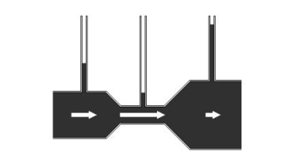
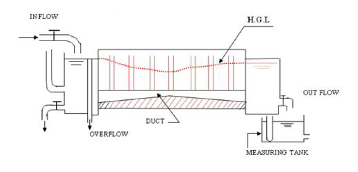

The Bernoulli theorem is an approximate relation between pressure, velocity, and elevation, and is valid in regions of steady, incompressible flow where net frictional forces are negligible. The equation is obtained when the Euler’s equation is integrated along the streamline for a constant density (incompressible) fluid. The constant of integration (called the Bernoulli’s constant) varies from one streamline to another but remains constant along a streamline in steady, frictionless, incompressible flow. Despite its simplicity, it has been proven to be a very powerful tool for fluid mechanics.

Bernoulli’s equation states that the “sum of the kinetic energy (velocity head), the pressure energy (static head) and Potential energy (elevation head) per unit weight of the fluid at any point remains constant” provided the flow is steady, irrotational, and frictionless and the fluid used is incompressible. This is however, on the assumption that energy is neither added to nor taken away by some external agency. The key approximation in the derivation of Bernoulli’s equation is that viscous effects are negligibly small compared to inertial, gravitational, and pressure effects. We can write the theorem as

$$
\text{Pressure head} \left(\frac{P}{\rho g}\right)
+ \text{Velocity head} \left(\frac{V^2}{2g}\right)
+ \text{Elevation head} \left(Z\right)
= \text{Constant}
$$

Where:

- $P$ = Pressure of the fluid, $\mathrm{N/m^2}$
- $\rho$ = Density of the fluid, $\mathrm{kg/m^3}$
- $V$ = Velocity of flow, $\mathrm{m/s}$
- $g$ = Acceleration due to gravity, $\mathrm{m/s^2}$
- $Z$ = Elevation above the datum line, $\mathrm{m}$

 <em>Figure 1: Pressure head increases with a decrease in velocity head.</em>> 

$$
\frac{P_1}{w} + \frac{V_1^2}{2g} + Z_1
=
\frac{P_2}{w} + \frac{V_2^2}{2g} + Z_2
=
\text{Constant}
$$

Where:

- $\frac{P}{w}$ is the **pressure head**.
- $\frac{V^2}{2g}$ is the **velocity head**.
- $Z$ is the **potential (elevation) head**.

Bernoulli's equation forms the basis for solving a wide variety of fluid flow problems, such as:

- Jets issuing from an orifice,
- Jet trajectories,
- Flow under a gate and over a weir,
- Flow measurement using obstruction meters,
- Flow around submerged objects,
- Flows associated with pumps and turbines.

The equipment is designed as a self-sufficient unit consisting of a sump tank, a measuring tank, and a pump for water circulation, as shown in Figure 1. The apparatus includes a supply tank connected to a flow channel. The channel gradually contracts over a certain length and then gradually enlarges over the remaining length.

 

 
 
<em>Figure 2: Bernoulli's appparatus</em>

<em>In this equipment the Z is constant and is not taken for calculation.</em>

